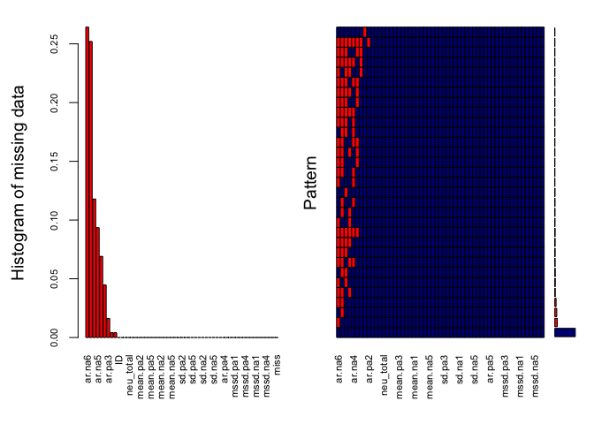
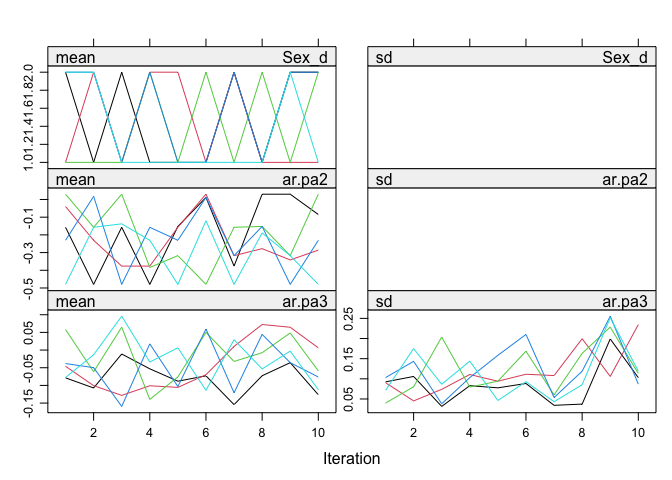
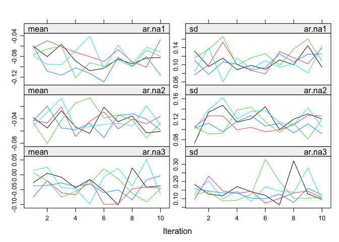
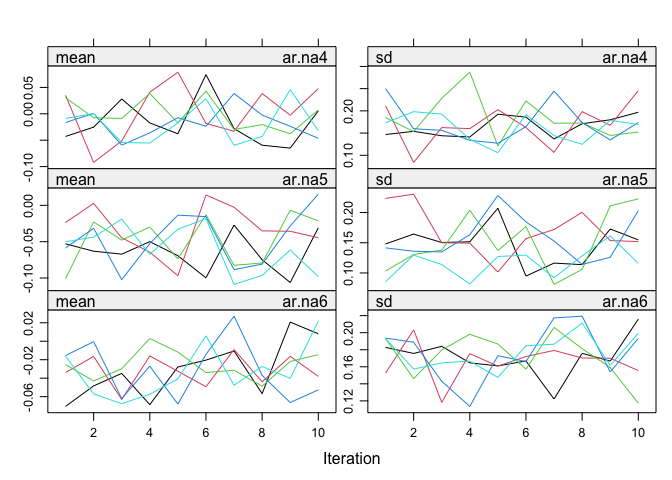
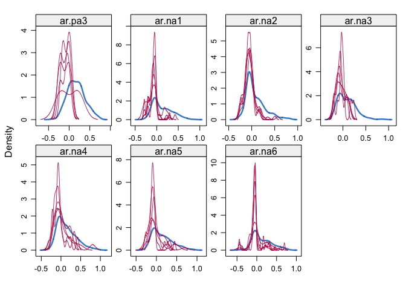

Multiple imputation
================
Anne Margit
8/24/2021

``` r
library(mice)
library(dplyr)
library(VIM)
library(haven)
library(skimr)
```

``` r
load("person2021_miss.Rdata")
baseline_data <- read_sav("200217_Baseline_Data_Total_Scores.sav")
```

``` r
baseline_data <- baseline_data %>% select(ID, Age, Sex_d, 
           dep_total, neu_total, extr_total)

person2021_miss_impute <- left_join(baseline_data, person2021_miss,by = "ID")

person2021_miss_impute$Sex_d <- as_factor(person2021_miss_impute$Sex_d)
```

Extra column indicating which values are missing

``` r
person2021_miss_impute <- person2021_miss_impute %>%
  mutate(miss = ifelse(is.na(ar.na6) | is.na(ar.na2) | is.na(ar.na1) | is.na(ar.na5) |
                         is.na(ar.na4) | is.na(ar.na3) | is.na(ar.pa3) | is.na(ar.pa2), 1, 0))
```

Missing data
pattern

``` r
aggr_plot <- aggr(person2021_miss_impute, col=c('navyblue','red'), numbers=TRUE, 
                  sortVars=TRUE, labels=names(data), cex.axis=.7, 
                  gap=3, ylab=c("Histogram of missing data","Pattern"))
```

    ## Warning in plot.aggr(res, ...): not enough vertical space to display frequencies
    ## (too many combinations)

<!-- -->

    ## 
    ##  Variables sorted by number of missings: 
    ##    Variable       Count
    ##      ar.na6 0.264227642
    ##      ar.na2 0.252032520
    ##      ar.na1 0.117886179
    ##      ar.na5 0.093495935
    ##      ar.na4 0.069105691
    ##      ar.na3 0.044715447
    ##      ar.pa3 0.016260163
    ##       Sex_d 0.004065041
    ##      ar.pa2 0.004065041
    ##          ID 0.000000000
    ##         Age 0.000000000
    ##   dep_total 0.000000000
    ##   neu_total 0.000000000
    ##  extr_total 0.000000000
    ##    mean.pa1 0.000000000
    ##    mean.pa2 0.000000000
    ##    mean.pa3 0.000000000
    ##    mean.pa4 0.000000000
    ##    mean.pa5 0.000000000
    ##    mean.pa6 0.000000000
    ##    mean.na1 0.000000000
    ##    mean.na2 0.000000000
    ##    mean.na3 0.000000000
    ##    mean.na4 0.000000000
    ##    mean.na5 0.000000000
    ##    mean.na6 0.000000000
    ##      sd.pa1 0.000000000
    ##      sd.pa2 0.000000000
    ##      sd.pa3 0.000000000
    ##      sd.pa4 0.000000000
    ##      sd.pa5 0.000000000
    ##      sd.pa6 0.000000000
    ##      sd.na1 0.000000000
    ##      sd.na2 0.000000000
    ##      sd.na3 0.000000000
    ##      sd.na4 0.000000000
    ##      sd.na5 0.000000000
    ##      sd.na6 0.000000000
    ##      ar.pa1 0.000000000
    ##      ar.pa4 0.000000000
    ##      ar.pa5 0.000000000
    ##      ar.pa6 0.000000000
    ##    mssd.pa1 0.000000000
    ##    mssd.pa2 0.000000000
    ##    mssd.pa3 0.000000000
    ##    mssd.pa4 0.000000000
    ##    mssd.pa5 0.000000000
    ##    mssd.pa6 0.000000000
    ##    mssd.na1 0.000000000
    ##    mssd.na2 0.000000000
    ##    mssd.na3 0.000000000
    ##    mssd.na4 0.000000000
    ##    mssd.na5 0.000000000
    ##    mssd.na6 0.000000000
    ##        miss 0.000000000

``` r
person2021_miss_impute %>%
  dplyr::select(ar.na1, ar.na2, ar.na3, ar.na4, ar.na5, ar.na6, ar.pa2, ar.pa3) %>%
  skim()
```

|                                                  |            |
| :----------------------------------------------- | :--------- |
| Name                                             | Piped data |
| Number of rows                                   | 246        |
| Number of columns                                | 8          |
| \_\_\_\_\_\_\_\_\_\_\_\_\_\_\_\_\_\_\_\_\_\_\_   |            |
| Column type frequency:                           |            |
| numeric                                          | 8          |
| \_\_\_\_\_\_\_\_\_\_\_\_\_\_\_\_\_\_\_\_\_\_\_\_ |            |
| Group variables                                  | None       |

Data summary

**Variable type:
numeric**

| skim\_variable | n\_missing | complete\_rate | mean |   sd |     p0 |    p25 |  p50 |  p75 | p100 | hist  |
| :------------- | ---------: | -------------: | ---: | ---: | -----: | -----: | ---: | ---: | ---: | :---- |
| ar.na1         |         29 |           0.88 | 0.13 | 0.22 | \-0.29 | \-0.05 | 0.06 | 0.28 | 0.84 | ▃▇▆▂▁ |
| ar.na2         |         62 |           0.75 | 0.08 | 0.21 | \-0.29 | \-0.07 | 0.00 | 0.17 | 0.81 | ▃▇▃▁▁ |
| ar.na3         |         11 |           0.96 | 0.09 | 0.19 | \-0.21 | \-0.06 | 0.06 | 0.20 | 0.89 | ▇▇▃▁▁ |
| ar.na4         |         17 |           0.93 | 0.14 | 0.24 | \-0.30 | \-0.04 | 0.09 | 0.29 | 0.95 | ▃▇▃▂▁ |
| ar.na5         |         23 |           0.91 | 0.14 | 0.24 | \-0.26 | \-0.06 | 0.10 | 0.29 | 0.90 | ▇▇▆▂▁ |
| ar.na6         |         65 |           0.74 | 0.13 | 0.24 | \-0.44 | \-0.05 | 0.06 | 0.29 | 0.78 | ▁▇▅▃▂ |
| ar.pa2         |          1 |           1.00 | 0.12 | 0.22 | \-0.48 | \-0.03 | 0.10 | 0.27 | 0.77 | ▁▅▇▃▁ |
| ar.pa3         |          4 |           0.98 | 0.17 | 0.21 | \-0.40 |   0.01 | 0.16 | 0.30 | 0.72 | ▁▆▇▅▂ |

Predictor matrix

``` r
imp0 <- mice(person2021_miss_impute, maxit = 0)
pred <- imp0$predictorMatrix
pred[, c("ID", "miss", "Sex_d")] <- 0
pred
```

Imputation

``` r
imp1 <- mice(person2021_miss_impute, m=5, maxit=10, meth="pmm", predictorMatrix = pred)
```

Checking

``` r
summary(imp1)
```

    Class: mids
    Number of multiple imputations:  5 
    Imputation methods:
            ID        Age      Sex_d  dep_total  neu_total extr_total   mean.pa1 
            ""         ""      "pmm"         ""         ""         ""         "" 
      mean.pa2   mean.pa3   mean.pa4   mean.pa5   mean.pa6   mean.na1   mean.na2 
            ""         ""         ""         ""         ""         ""         "" 
      mean.na3   mean.na4   mean.na5   mean.na6     sd.pa1     sd.pa2     sd.pa3 
            ""         ""         ""         ""         ""         ""         "" 
        sd.pa4     sd.pa5     sd.pa6     sd.na1     sd.na2     sd.na3     sd.na4 
            ""         ""         ""         ""         ""         ""         "" 
        sd.na5     sd.na6     ar.pa1     ar.pa2     ar.pa3     ar.pa4     ar.pa5 
            ""         ""         ""      "pmm"      "pmm"         ""         "" 
        ar.pa6     ar.na1     ar.na2     ar.na3     ar.na4     ar.na5     ar.na6 
            ""      "pmm"      "pmm"      "pmm"      "pmm"      "pmm"      "pmm" 
      mssd.pa1   mssd.pa2   mssd.pa3   mssd.pa4   mssd.pa5   mssd.pa6   mssd.na1 
            ""         ""         ""         ""         ""         ""         "" 
      mssd.na2   mssd.na3   mssd.na4   mssd.na5   mssd.na6       miss 
            ""         ""         ""         ""         ""         "" 
    PredictorMatrix:
               ID Age Sex_d dep_total neu_total extr_total mean.pa1 mean.pa2
    ID          0   1     0         1         1          1        1        1
    Age         0   0     0         1         1          1        1        1
    Sex_d       0   1     0         1         1          1        1        1
    dep_total   0   1     0         0         1          1        1        1
    neu_total   0   1     0         1         0          1        1        1
    extr_total  0   1     0         1         1          0        1        1
               mean.pa3 mean.pa4 mean.pa5 mean.pa6 mean.na1 mean.na2 mean.na3
    ID                1        1        1        1        1        1        1
    Age               1        1        1        1        1        1        1
    Sex_d             1        1        1        1        1        1        1
    dep_total         1        1        1        1        1        1        1
    neu_total         1        1        1        1        1        1        1
    extr_total        1        1        1        1        1        1        1
               mean.na4 mean.na5 mean.na6 sd.pa1 sd.pa2 sd.pa3 sd.pa4 sd.pa5 sd.pa6
    ID                1        1        1      1      1      1      1      1      1
    Age               1        1        1      1      1      1      1      1      1
    Sex_d             1        1        1      1      1      1      1      1      1
    dep_total         1        1        1      1      1      1      1      1      1
    neu_total         1        1        1      1      1      1      1      1      1
    extr_total        1        1        1      1      1      1      1      1      1
               sd.na1 sd.na2 sd.na3 sd.na4 sd.na5 sd.na6 ar.pa1 ar.pa2 ar.pa3
    ID              1      1      1      1      1      1      1      1      1
    Age             1      1      1      1      1      1      1      1      1
    Sex_d           1      1      1      1      1      1      1      1      1
    dep_total       1      1      1      1      1      1      1      1      1
    neu_total       1      1      1      1      1      1      1      1      1
    extr_total      1      1      1      1      1      1      1      1      1
               ar.pa4 ar.pa5 ar.pa6 ar.na1 ar.na2 ar.na3 ar.na4 ar.na5 ar.na6
    ID              1      1      1      1      1      1      1      1      1
    Age             1      1      1      1      1      1      1      1      1
    Sex_d           1      1      1      1      1      1      1      1      1
    dep_total       1      1      1      1      1      1      1      1      1
    neu_total       1      1      1      1      1      1      1      1      1
    extr_total      1      1      1      1      1      1      1      1      1
               mssd.pa1 mssd.pa2 mssd.pa3 mssd.pa4 mssd.pa5 mssd.pa6 mssd.na1
    ID                1        1        1        1        1        1        1
    Age               1        1        1        1        1        1        1
    Sex_d             1        1        1        1        1        1        1
    dep_total         1        1        1        1        1        1        1
    neu_total         1        1        1        1        1        1        1
    extr_total        1        1        1        1        1        1        1
               mssd.na2 mssd.na3 mssd.na4 mssd.na5 mssd.na6 miss
    ID                1        1        1        1        1    0
    Age               1        1        1        1        1    0
    Sex_d             1        1        1        1        1    0
    dep_total         1        1        1        1        1    0
    neu_total         1        1        1        1        1    0
    extr_total        1        1        1        1        1    0

``` r
plot(imp1)
```

<!-- --><!-- --><!-- -->

``` r
densityplot(imp1)
```

<!-- -->

Dataframe

``` r
impdata2021 <- complete(imp1)
```

Compare old and new datasets

``` r
person2021_miss_impute %>%
  dplyr::select(ar.na1, ar.na2, ar.na3, ar.na4, ar.na5, ar.na6, ar.pa2, ar.pa3) %>%
  skim()
```

|                                                  |            |
| :----------------------------------------------- | :--------- |
| Name                                             | Piped data |
| Number of rows                                   | 246        |
| Number of columns                                | 8          |
| \_\_\_\_\_\_\_\_\_\_\_\_\_\_\_\_\_\_\_\_\_\_\_   |            |
| Column type frequency:                           |            |
| numeric                                          | 8          |
| \_\_\_\_\_\_\_\_\_\_\_\_\_\_\_\_\_\_\_\_\_\_\_\_ |            |
| Group variables                                  | None       |

Data summary

**Variable type:
numeric**

| skim\_variable | n\_missing | complete\_rate | mean |   sd |     p0 |    p25 |  p50 |  p75 | p100 | hist  |
| :------------- | ---------: | -------------: | ---: | ---: | -----: | -----: | ---: | ---: | ---: | :---- |
| ar.na1         |         29 |           0.88 | 0.13 | 0.22 | \-0.29 | \-0.05 | 0.06 | 0.28 | 0.84 | ▃▇▆▂▁ |
| ar.na2         |         62 |           0.75 | 0.08 | 0.21 | \-0.29 | \-0.07 | 0.00 | 0.17 | 0.81 | ▃▇▃▁▁ |
| ar.na3         |         11 |           0.96 | 0.09 | 0.19 | \-0.21 | \-0.06 | 0.06 | 0.20 | 0.89 | ▇▇▃▁▁ |
| ar.na4         |         17 |           0.93 | 0.14 | 0.24 | \-0.30 | \-0.04 | 0.09 | 0.29 | 0.95 | ▃▇▃▂▁ |
| ar.na5         |         23 |           0.91 | 0.14 | 0.24 | \-0.26 | \-0.06 | 0.10 | 0.29 | 0.90 | ▇▇▆▂▁ |
| ar.na6         |         65 |           0.74 | 0.13 | 0.24 | \-0.44 | \-0.05 | 0.06 | 0.29 | 0.78 | ▁▇▅▃▂ |
| ar.pa2         |          1 |           1.00 | 0.12 | 0.22 | \-0.48 | \-0.03 | 0.10 | 0.27 | 0.77 | ▁▅▇▃▁ |
| ar.pa3         |          4 |           0.98 | 0.17 | 0.21 | \-0.40 |   0.01 | 0.16 | 0.30 | 0.72 | ▁▆▇▅▂ |

``` r
impdata2021 %>%
  dplyr::select(ar.na1, ar.na2, ar.na3, ar.na4, ar.na5, ar.na6, ar.pa2, ar.pa3) %>%
  skim()
```

|                                                  |            |
| :----------------------------------------------- | :--------- |
| Name                                             | Piped data |
| Number of rows                                   | 246        |
| Number of columns                                | 8          |
| \_\_\_\_\_\_\_\_\_\_\_\_\_\_\_\_\_\_\_\_\_\_\_   |            |
| Column type frequency:                           |            |
| numeric                                          | 8          |
| \_\_\_\_\_\_\_\_\_\_\_\_\_\_\_\_\_\_\_\_\_\_\_\_ |            |
| Group variables                                  | None       |

Data summary

**Variable type:
numeric**

| skim\_variable | n\_missing | complete\_rate | mean |   sd |     p0 |    p25 |    p50 |  p75 | p100 | hist  |
| :------------- | ---------: | -------------: | ---: | ---: | -----: | -----: | -----: | ---: | ---: | :---- |
| ar.na1         |          0 |              1 | 0.10 | 0.22 | \-0.29 | \-0.06 |   0.01 | 0.25 | 0.84 | ▅▇▅▂▁ |
| ar.na2         |          0 |              1 | 0.04 | 0.20 | \-0.29 | \-0.07 | \-0.03 | 0.13 | 0.81 | ▅▇▂▁▁ |
| ar.na3         |          0 |              1 | 0.08 | 0.19 | \-0.21 | \-0.08 |   0.05 | 0.20 | 0.89 | ▇▆▃▁▁ |
| ar.na4         |          0 |              1 | 0.13 | 0.24 | \-0.30 | \-0.05 |   0.09 | 0.29 | 0.95 | ▃▇▃▂▁ |
| ar.na5         |          0 |              1 | 0.13 | 0.24 | \-0.26 | \-0.06 |   0.07 | 0.28 | 0.90 | ▇▆▅▂▁ |
| ar.na6         |          0 |              1 | 0.10 | 0.24 | \-0.44 | \-0.06 | \-0.02 | 0.25 | 0.78 | ▁▇▃▂▁ |
| ar.pa2         |          0 |              1 | 0.12 | 0.22 | \-0.48 | \-0.03 |   0.10 | 0.27 | 0.77 | ▁▅▇▃▁ |
| ar.pa3         |          0 |              1 | 0.17 | 0.21 | \-0.40 |   0.01 |   0.15 | 0.30 | 0.72 | ▁▆▇▅▂ |

Save

``` r
impdata2021<- impdata2021[with(impdata2021, order(ID)),]

save("impdata2021", file="impdata2021.Rdata")

impdata2021pca <- impdata2021 %>%
  dplyr::select(-c(ID, Age, Sex_d, dep_total, neu_total, extr_total, miss))

save("impdata2021pca", file="impdata2021pca")
```
